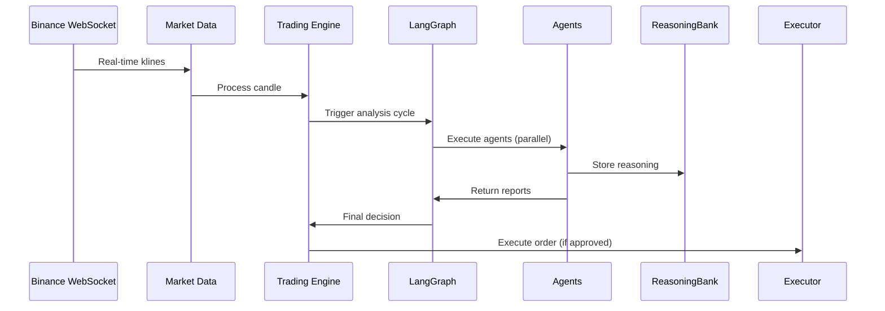

# 🏗️ FenixAI v2.0 - System Architecture

## Overview

FenixAI v2.0 is a sophisticated multi-agent trading system built on **LangGraph** for state machine orchestration. The system employs specialized AI agents that collaborate to analyze markets, manage risk, and execute trades on Binance Futures.

## High-Level Architecture

```
┌─────────────────────────────────────────────────────────────────────────────┐
│                              FENIX AI v2.0                                  │
├─────────────────────────────────────────────────────────────────────────────┤
│                                                                             │
│  ┌─────────────┐    ┌──────────────────────────────────────────────────┐    │
│  │   Frontend  │◄──►│              FastAPI + Socket.IO                 │    │
│  │  React/Vite │    │                  (Real-time)                     │    │
│  └─────────────┘    └────────────────────┬─────────────────────────────┘    │
│                                          │                                  │
│  ┌───────────────────────────────────────▼──────────────────────────────┐   │
│  │                      TRADING ENGINE                                  │   │
│  │  ┌─────────────────────────────────────────────────────────────────┐ │   │
│  │  │                 LangGraph Orchestrator                          │ │   │
│  │  │                   (State Machine)                               │ │   │
│  │  └─────────────────────────────────────────────────────────────────┘ │   │
│  │           │              │              │              │             │   │
│  │     ┌─────▼─────┐  ┌─────▼─────┐  ┌─────▼─────┐  ┌─────▼─────┐       │   │
│  │     │ Technical │  │  Visual   │  │ Sentiment │  │   QABBA   │       │   │
│  │     │  Agent    │  │  Agent    │  │  Agent    │  │  Agent    │       │   │
│  │     └─────┬─────┘  └─────┬─────┘  └─────┬─────┘  └─────┬─────┘       │   │
│  │           │              │              │              │             │   │
│  │     ┌─────▼──────────────▼──────────────▼──────────────▼─────┐       │   │
│  │     │              Decision Agent + Risk Manager             │       │   │
│  │     │           (Dynamic Weighting + LLM-as-Judge)           │       │   │
│  │     └────────────────────────┬───────────────────────────────┘       │   │
│  └──────────────────────────────┼───────────────────────────────────────┘   │
│                                 │                                           │
│  ┌──────────────────────────────▼───────────────────────────────────────┐   │
│  │                         MEMORY LAYER                                 │   │
│  │  ┌─────────────────┐  ┌─────────────────┐  ┌─────────────────────┐   │   │
│  │  │  ReasoningBank  │  │  Trade Memory   │  │   LLM-as-Judge      │   │   │
│  │  │ (Semantic Search)│ │   (History)     │  │  (Self-Evaluation)  │   │   │
│  │  └─────────────────┘  └─────────────────┘  └─────────────────────┘   │   │
│  └──────────────────────────────────────────────────────────────────────┘   │
│                                                                             │
│  ┌──────────────────────────────────────────────────────────────────────┐   │
│  │                        EXECUTION LAYER                               │   │
│  │  ┌─────────────────┐  ┌─────────────────┐  ┌─────────────────────┐   │   │
│  │  │  Binance Client │  │  Order Executor │  │   Market Data       │   │   │
│  │  │ (REST + WS)     │  │  (Paper/Live)   │  │   (Real-time)       │   │   │
│  │  └─────────────────┘  └─────────────────┘  └─────────────────────┘   │   │
│  └──────────────────────────────────────────────────────────────────────┘   │
│                                                                             │
└─────────────────────────────────────────────────────────────────────────────┘
```

## Core Components

### 1. LangGraph Orchestrator (`src/core/langgraph_orchestrator.py`)

The heart of FenixAI v2.0. Implements a **state machine** that coordinates all agents through a directed graph.

```python
# Simplified flow
START → Technical Agent → Visual Agent → Sentiment Agent 
      → QABBA Agent → Decision Agent → Risk Check → END
```

**Key Features:**

- **FenixAgentState**: Typed dictionary holding all market data, indicators, and agent reports
- **Parallel execution**: Agents can run concurrently when independent
- **Checkpointing**: LangGraph's MemorySaver for state persistence
- **Conditional routing**: Dynamic paths based on agent outputs

### 2. Multi-Agent System (`src/agents/`)

| Agent | Model | Purpose |
|-------|-------|---------|
| **Technical Analyst** | qwen3:8b | RSI, MACD, ADX, market structure analysis |
| **Visual Analyst** | qwen3-vl:8b | Chart pattern recognition from TradingView screenshots |
| **Sentiment Analyst** | qwen3:8b | News and social media sentiment analysis |
| **QABBA Agent** | qwen3:8b | Bollinger Bands, volatility, squeeze detection |
| **Decision Agent** | qwen3:8b | Weighted consensus and final decision |
| **Risk Manager** | Python | Circuit breakers, position sizing, exposure limits |

### 3. ReasoningBank (`src/memory/reasoning_bank.py`)

Inspired by academic research (arXiv:2509.25140), this component provides:

- **Semantic search**: Find similar past decisions using sentence-transformers
- **Self-judgment**: LLM-as-Judge evaluates decision quality
- **Reward shaping**: Learn from trade outcomes
- **Audit trail**: Full traceability of agent reasoning

### 4. Multi-Provider LLM System (`src/inference/`)

Flexible LLM backend supporting:

| Provider | Use Case |
|----------|----------|
| **Ollama** | Local inference, privacy-first |
| **MLX** | Optimized for Apple Silicon |
| **Groq** | Ultra-fast cloud inference |
| **HuggingFace** | Wide model selection |

Configuration via `config/llm_providers.yaml`:

```yaml
active_profile: "all_local"  # Options: all_local, mixed_providers, mlx_optimized, all_cloud

all_local:
  technical:
    provider_type: "ollama_local"
    model_name: "qwen3:8b"
    temperature: 0.1
```

### 5. Trading Engine (`src/trading/`)

- **BinanceClient**: Async client for Futures API (testnet/live)
- **MarketDataManager**: Real-time klines, orderbook, trades
- **OrderExecutor**: Paper trading and live execution
- **Circuit Breakers**: Automatic risk controls

## Data Flow



## Directory Structure

```
src/
├── agents/              # AI agents (Technical, Visual, Sentiment, QABBA, Decision)
├── api/                 # FastAPI server
├── core/                # LangGraph orchestrator
├── inference/           # Multi-provider LLM clients
├── memory/              # ReasoningBank, TradeMemory
├── models/              # Pydantic models
├── prompts/             # Agent prompts
├── risk/                # Risk management
├── security/            # Secrets, path validation
├── tools/               # Chart generator, scrapers
├── trading/             # Engine, Binance client, executor
└── utils/               # Helpers

config/
├── fenix.yaml           # Main configuration
├── llm_providers.yaml   # LLM provider profiles
└── settings.py          # Environment settings

frontend/                # React + Vite + TypeScript dashboard
```

## Technology Stack

| Layer | Technology |
|-------|------------|
| **Orchestration** | LangGraph, LangChain |
| **LLM Inference** | Ollama, MLX, Groq, HuggingFace |
| **Backend** | Python 3.10+, FastAPI, Socket.IO |
| **Frontend** | React 18, Vite, TypeScript, TailwindCSS |
| **State Management** | Zustand |
| **Exchange** | Binance Futures (ccxt, python-binance) |
| **Data** | Redis, SQLAlchemy |
| **Monitoring** | Prometheus, structlog |

## Security Considerations

1. **API Keys**: Managed via `SecureSecretsManager`
2. **Chart Paths**: Validated to prevent path traversal
3. **Live Trading**: Requires explicit `--allow-live` flag
4. **Rate Limiting**: Respects Binance API limits

---

**See also:**

- [AGENTS.md](AGENTS.md) - Detailed agent documentation
- [API.md](API.md) - REST API reference
- [QUICKSTART.md](QUICKSTART.md) - Getting started guide
